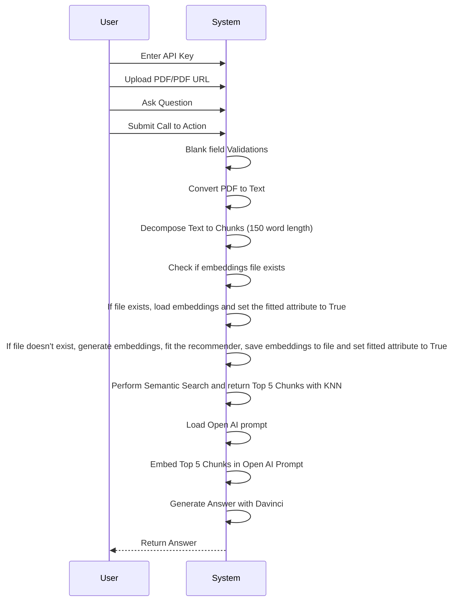

# pdfGPT
   
### Problem Description : 
1. User can create a project on the frontend, providing - Title, Description and a PDF file (uploaded to cloud bucket like s3) stored in Postgres.

2. On the backend we process the pdf file to generate Vector Embeddings of the content inside the PDF and store that in Postgres. Note that the processing should happen in BullMQ worker. 

3. User could view all the projects from the frontend dashboard with the status -> 'creating', 'failed', 'created'.

4. Users can open up any project where they will be shown a chat interface like ChatGPT to ask questions and get the relevant answers from the Vectors stored in Postgres with proper context. (You could use any LLM APIs). Note: No use of Langchain :))

5. Finally dockerize the app. Creating docker containers for api backend and bullmq worker.

### Solution: What is PDF GPT ?
1. PDF GPT allows you to chat with an uploaded PDF file using GPT functionalities.
2. The application intelligently breaks the document into smaller chunks and employs a powerful Deep Averaging Network Encoder to generate embeddings.
3. A semantic search is first performed on your pdf content and the most relevant embeddings are passed to the Open AI.
4. A custom logic generates precise responses. The returned response can even cite the page number in square brackets([]) where the information is located, adding credibility to the responses and helping to locate pertinent information quickly. The Responses are much better than the naive responses by Open AI.

### Docker
Run `docker-compose -f docker-compose.yaml up` to use it with Docker compose.


## Use `pdfGPT` on Production

#### Local playground
1. Run `lc-serve deploy local api` on one terminal to expose the app as API using langchain-serve.
2. Run `python app.py` on another terminal for a local gradio playground.
3. Open `http://localhost:7860` on your browser and interact with the app.


#### Cloud deployment

Make `pdfGPT` production ready by deploying it on [Jina Cloud](https://cloud.jina.ai/).

`lc-serve deploy jcloud api` 

<details>
<summary>Show command output</summary>

```text
╭──────────────┬──────────────────────────────────────────────────────────────────────────────────────╮
│ App ID       │                                 langchain-3ff4ab2c9d                                 │
├──────────────┼──────────────────────────────────────────────────────────────────────────────────────┤
│ Phase        │                                       Serving                                        │
├──────────────┼──────────────────────────────────────────────────────────────────────────────────────┤
│ Endpoint     │                      https://langchain-3ff4ab2c9d.wolf.jina.ai                       │
├──────────────┼──────────────────────────────────────────────────────────────────────────────────────┤
│ App logs     │                               dashboards.wolf.jina.ai                                │
├──────────────┼──────────────────────────────────────────────────────────────────────────────────────┤
│ Swagger UI   │                    https://langchain-3ff4ab2c9d.wolf.jina.ai/docs                    │
├──────────────┼──────────────────────────────────────────────────────────────────────────────────────┤
│ OpenAPI JSON │                https://langchain-3ff4ab2c9d.wolf.jina.ai/openapi.json                │
╰──────────────┴──────────────────────────────────────────────────────────────────────────────────────╯
```

</details>

#### Interact using cURL

(Change the URL to your own endpoint)

**PDF url**
```bash
curl -X 'POST' \
  'https://langchain-3ff4ab2c9d.wolf.jina.ai/ask_url' \
  -H 'accept: application/json' \
  -H 'Content-Type: application/json' \
  -d '{
  "url": "https://uiic.co.in/sites/default/files/uploads/downloadcenter/Arogya%20Sanjeevani%20Policy%20CIS_2.pdf",
  "question": "What'\''s the cap on room rent?",
  "envs": {
    "OPENAI_API_KEY": "'"${OPENAI_API_KEY}"'"
    }
}'

{"result":" Room rent is subject to a maximum of INR 5,000 per day as specified in the Arogya Sanjeevani Policy [Page no. 1].","error":"","stdout":""}
```

**PDF file**
```bash
QPARAMS=$(echo -n 'input_data='$(echo -n '{"question": "What'\''s the cap on room rent?", "envs": {"OPENAI_API_KEY": "'"${OPENAI_API_KEY}"'"}}' | jq -s -R -r @uri))
curl -X 'POST' \
  'https://langchain-3ff4ab2c9d.wolf.jina.ai/ask_file?'"${QPARAMS}" \
  -H 'accept: application/json' \
  -H 'Content-Type: multipart/form-data' \
  -F 'file=@Arogya_Sanjeevani_Policy_CIS_2.pdf;type=application/pdf'

{"result":" Room rent is subject to a maximum of INR 5,000 per day as specified in the Arogya Sanjeevani Policy [Page no. 1].","error":"","stdout":""}
```

## Running on localhost
1. Pull the image by entering the following command in your terminal or command prompt:
```bash
docker pull registry.hf.space/ShivamAgarwal-code-pdfchatter:latest
```
2. Download the Universal Sentence Encoder locally to your project's root folder. This is important because otherwise, 915 MB will be downloaded at runtime everytime you run it.
3. Download the encoder using this [link](https://tfhub.dev/google/universal-sentence-encoder/4?tf-hub-format=compressed).
4. Extract the downloaded file and place it in your project's root folder as shown below:
```text
Root folder of your project
└───Universal Sentence Encoder
|   ├───assets
|   └───variables
|   └───saved_model.pb
|
└───app.py
```
5. If you have downloaded it locally, replace the code on line 68 in the API file:
```python
self.use = hub.load('https://tfhub.dev/google/universal-sentence-encoder/4')
```
with:
```python
self.use = hub.load('./Universal Sentence Encoder/')
```
6. Now, To run PDF-GPT, enter the following command:

```bash
docker run -it -p 7860:7860 --platform=linux/amd64 registry.hf.space/ShivamAgarwal-code-pdfchatter:latest python app.py
```


## UML


### Flowchart
```mermaid
flowchart TB
A[Input] --> B[URL]
A -- Upload File manually --> C[Parse PDF]
B --> D[Parse PDF] -- Preprocess --> E[Dynamic Text Chunks]
C -- Preprocess --> E[Dynamic Text Chunks with citation history]
E --Fit-->F[Generate text embedding with Deep Averaging Network Encoder on each chunk]
F -- Query --> G[Get Top Results]
G -- K-Nearest Neighbour --> K[Get Nearest Neighbour - matching citation references]
K -- Generate Prompt --> H[Generate Answer]
H -- Output --> I[Output]
